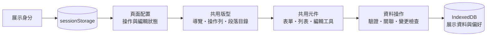

# 嶼序工作台｜後台系統與共用架構展示

> 將後台實務中的共用版型、表單、操作列與協作工具，整理成可直接體驗的展示工作台。從查詢到編修，在不同模組中保有一致的操作方式。

**[開啟 Demo ↗](https://cutecat8110.github.io/islet-desk-demo/)** · [共用架構](https://cutecat8110.github.io/islet-desk-demo/#/components?section=architecture) · [文字編輯器](https://cutecat8110.github.io/islet-desk-demo/#/components?section=rich-text) · [設計系統](https://cutecat8110.github.io/islet-desk-demo/#/design-system)

## 📋 專案概述

本作品聚焦後台介面如何形成可沿用的前端基礎：頁面配置自己的操作，版型統一處理呈現，元件維持一致的欄位、驗證與互動。資產、合約與維護流程提供完整操作情境；逐字稿與公告編輯器呈現較特殊的編輯需求。

展示使用獨立虛構品牌與全新合成資料，精選代表流程重新整理。它是純前端展示，原始碼保留私有；本儲存庫僅提供可公開的靜態成品、介紹與展示圖。

## 🧭 建議體驗順序

登入頁選取角色即可帶入展示帳密，再按「登入」。建議第一次使用管理員，之後切換其他角色比較操作差異。

| 順序 | 體驗入口                                                                                      | 可以觀察的重點                                                  |
| ---- | --------------------------------------------------------------------------------------------- | --------------------------------------------------------------- |
| 1    | [資產查詢](https://cutecat8110.github.io/islet-desk-demo/#/assets)                            | 條件輸入與查詢分離、儲存條件、排序、分頁、跨頁勾選及 CSV 匯出。 |
| 2    | [資產長表單](https://cutecat8110.github.io/islet-desk-demo/#/assets/asset-1/edit)             | 分區欄位、右側段落目錄、錯誤定位、圖片預覽及未儲存提醒。        |
| 3    | [合約關聯](https://cutecat8110.github.io/islet-desk-demo/#/contracts/contract-1/edit)         | 選取資產、確認／取消、關聯明細與期間驗證。                      |
| 4    | [會議逐字稿](https://cutecat8110.github.io/islet-desk-demo/#/minutes)                         | 搜尋與序號定位、發言人編修、指定位置新增及校對鎖定。            |
| 5    | [操作列範例](https://cutecat8110.github.io/islet-desk-demo/#/components?section=architecture) | 切換編輯／唯讀／處理中，直接觀察頁面操作列與窄版選單的變化。    |
| 6    | [文字編輯器](https://cutecat8110.github.io/islet-desk-demo/#/components?section=rich-text)    | 格式同步、純文字輸出、復原／重做、驗證、唯讀及未套用提醒。      |

| 展示角色 | 操作差異                                       |
| -------- | ---------------------------------------------- |
| 管理員   | 查詢、新增、編修、刪除與逐字稿校對。           |
| 編輯者   | 查詢、新增、編修與刪除；逐字稿不提供校對操作。 |
| 唯讀     | 查詢、檢視與匯出；不能修改業務資料。           |

元件頁的情境切換只影響範例，不變更登入身分。所有角色均為瀏覽器模擬，不代表真實後端權限驗證。

## 🧩 共用架構與實作重點

- **共用版型**：分組側欄、固定次導覽與操作列；長表單自動整理段落目錄，提供 14／16／20px 字級切換。
- **可配置操作列**：頁面提供操作名稱、圖示、狀態與執行方法，外框統一呈現；窄畫面收進「更多功能」，處理期間阻止重複提交。
- **一致的資料編修**：共用欄位呈現與錯誤定位，保留草稿／已保存狀態、未儲存離開提醒與跨分頁修改衝突檢查。
- **代表性編輯工具**：逐字稿支援段落定位與校對；Quill 公告範例以 Delta 同步格式內容及純文字，提供獨立唯讀預覽。
- **元件使用說明**：「用法與介面」附輸入／輸出及實際使用位置，從範例連到完整操作頁。[前往元件展示](https://cutecat8110.github.io/islet-desk-demo/#/components)
- **視覺規範**：語意色階、字級、間距、響應式版面、圖示及操作狀態直接對應目前介面。[前往設計系統](https://cutecat8110.github.io/islet-desk-demo/#/design-system)

### 逐字稿編輯與校對

### 共用操作列與互動元件

## 🔨 核心技術

| 技術                             | 在展示中的用途                              |
| -------------------------------- | ------------------------------------------- |
| Vue 3 / TypeScript               | 元件介面、頁面狀態與資料操作規則。          |
| PrimeVue 4                       | 表單、資料表、對話框、選單與可用狀態。      |
| Vue Router                       | Hash 路由、登入後目的地及未儲存離開保護。   |
| Quill 2.0.3                      | 按需載入的共用文字編輯器與 Delta 內容模型。 |
| Vite                             | 靜態建置與依頁面拆分載入。                  |
| IndexedDB / sessionStorage       | 本機展示資料、偏好與當前展示身分。          |
| Node.js Test Runner / Playwright | 資料規則、互動、跨分頁與響應式回歸驗證。    |

## 展示資料與使用範圍

- 不需申請帳號，也不連接正式業務服務。請使用登入頁的展示帳密，不輸入真實密碼或敏感資料。
- 業務資料與修改保留在此瀏覽器，重新整理仍可使用；不同訪客彼此獨立。元件頁範例只保留到離頁，明確儲存的查詢條件除外。
- 圖片僅在本機預覽及保存；匯出由目前假資料產生。文字編輯器貼上採純文字，不接受外部媒體或連結。
- 右上角「重設資料」恢復本作品的初始資料、偏好並登出，不清除其他網站資料；同一瀏覽器已開啟的本作品分頁會同步更新。
- 手機版以瀏覽器尺寸模擬驗證；不宣稱真機或真實後端安全測試。保留精選展示流程，未提供原完整業務系統。
