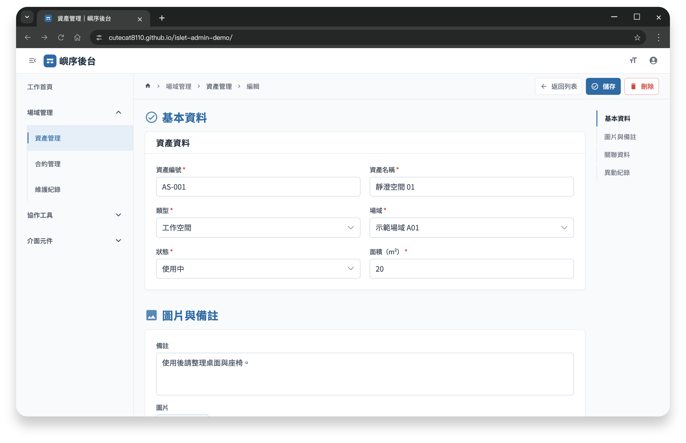
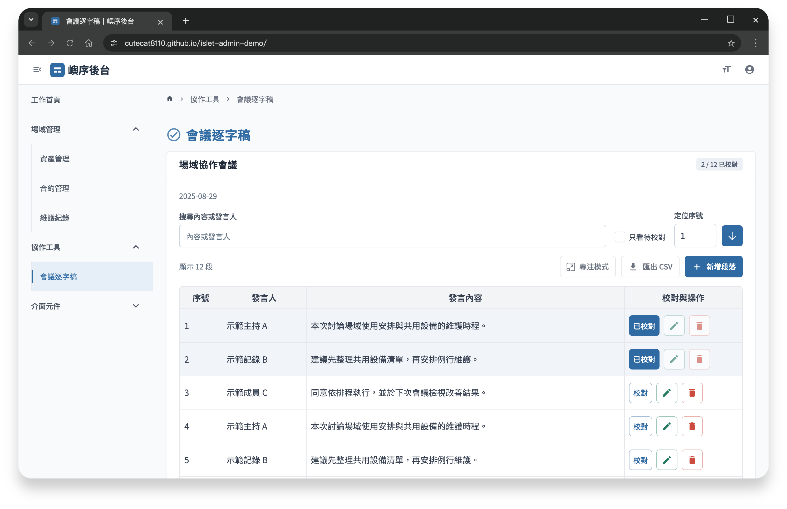
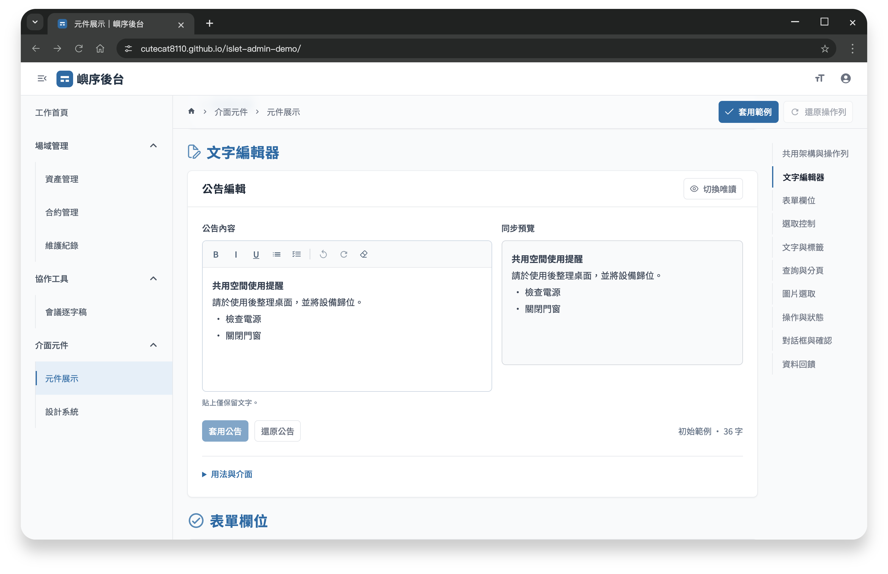
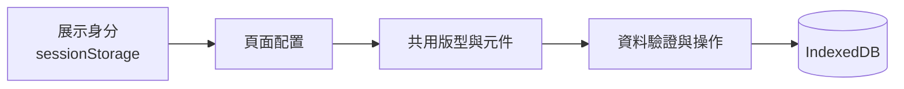

# 嶼序後台｜後台系統與共用架構展示

以共用版型、操作列與表單流程，展示可複用的後台前端架構。

**[開啟 Demo ↗](https://cutecat8110.github.io/islet-admin-demo/)** · [元件展示](https://cutecat8110.github.io/islet-admin-demo/#/components) · [設計系統](https://cutecat8110.github.io/islet-admin-demo/#/design-system)

## 展示重點

| 功能 | 體驗重點 |
| --- | --- |
| [共用架構](https://cutecat8110.github.io/islet-admin-demo/#/components?section=architecture) | 頁面配置、共用版型、元件與資料操作。 |
| [操作列](https://cutecat8110.github.io/islet-admin-demo/#/components?section=architecture) | 編輯／唯讀／處理中配置，手機收進「更多功能」。 |
| [長表單](https://cutecat8110.github.io/islet-admin-demo/#/assets/asset-1/edit) | 分區目錄、欄位驗證、圖片預覽與未儲存提醒。 |
| [編輯工具](https://cutecat8110.github.io/islet-admin-demo/#/components?section=rich-text) | 文字格式、同步預覽與復原；另可體驗[逐字稿校對](https://cutecat8110.github.io/islet-admin-demo/#/minutes)。 |

建議依 **共用架構 → 操作列 → 長表單 → 編輯工具** 體驗。登入頁點選角色即可帶入展示帳密。資產、合約與維護為操作示例。

展示角色

- **管理員**：查詢、新增、編修、刪除與逐字稿校對。
- **編輯者**：可修改資料，不提供逐字稿校對。
- **唯讀**：查詢、檢視與匯出。

更多畫面：逐字稿與文字編輯器

## 核心技術

Vue 3／TypeScript 組織頁面與元件，PrimeVue 統一介面，Quill 處理文字編輯，Vite 依頁面拆分載入。

查看架構

Vue Router 處理登入後目的地與離頁保護；IndexedDB 保存展示資料與偏好，sessionStorage 保存當前身分。

## 展示說明

- 品牌與資料皆為虛構，權限為瀏覽器模擬，不連接正式服務；原始碼保留私有。
- 修改與圖片只存於目前瀏覽器；元件範例於離頁後清除，已儲存的查詢條件除外。
- 右上角「重設資料」可恢復初始內容並登出，不影響其他作品。
